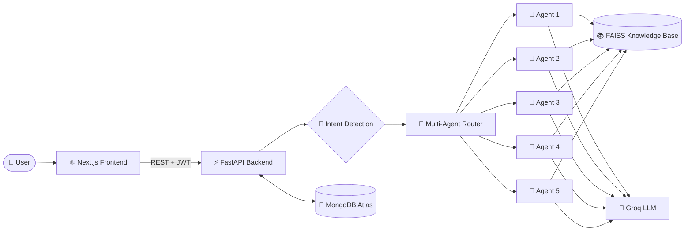

<div align="center">


<a href="https://git.io/typing-svg">
  
</a>

<br/>


**An intelligent, multi-agent customer support platform that understands intent, routes to the right specialist, and answers from your own knowledge base.**

[🚀 Live Demo](YOUR_DEMO_URL) · [📖 API Docs](YOUR_API_URL/docs) · [🐛 Report Bug](https://github.com/D0027/YOUR_REPO/issues) · [✨ Request Feature](https://github.com/D0027/YOUR_REPO/issues)

</div>

---

## 📑 Table of Contents

- [✨ Highlights](#-highlights)
- [🏗️ Architecture](#️-architecture)
- [🧰 Tech Stack](#-tech-stack)
- [🚀 Quick Start](#-quick-start)
- [🌐 Deployment](#-deployment)
- [📊 Module Coverage](#-module-coverage)
- [🔑 Environment Variables](#-environment-variables)
- [👨‍💻 Author](#-author)

---

## ✨ Highlights

<table>
<tr>
<td width="50%">

### 🧠 Smart Routing
Intent detection classifies every message and hands it to the best of **5 specialized agents**.

### 📚 RAG Knowledge Base
FAISS-powered retrieval grounds answers in your docs. Rebuild the index anytime from the admin panel.

</td>
<td width="50%">

### 💬 Conversation Memory
Context-aware replies that remember the whole conversation.

### 📈 Analytics Dashboard
Track conversations, intents, and agent performance in real time.

</td>
</tr>
<tr>
<td colspan="2" align="center">

### 🔐 Secure by Default
JWT authentication · role-based admin panel · **+ 45 bonus features**

</td>
</tr>
</table>

---

## 🏗️ Architecture



---

## 🧰 Tech Stack

| Layer | Technology |
|---|---|
| 🎨 Frontend | Next.js · React |
| ⚙️ Backend | FastAPI · Python |
| 🧠 LLM | Groq (`gpt-oss-120b`, vision model) |
| 🔎 Retrieval | FAISS vector store |
| 🗄️ Database | MongoDB Atlas |
| 📧 Email | SMTP (Gmail) |
| 🐳 DevOps | Docker · Vercel · Railway / Render |

---

## 🚀 Quick Start

<details open>
<summary><b>⚙️ Backend</b></summary>

```bash
cd backend
python -m venv venv
venv\Scripts\activate          # macOS/Linux: source venv/bin/activate
pip install -r requirements.txt
cp .env.example .env
python -m vectorstore.store
uvicorn main:app --reload --port 8000
```
📄 API docs: `http://localhost:8000/docs`

</details>

<details open>
<summary><b>🎨 Frontend</b></summary>

```bash
cd frontend
npm install
npm run dev
```
🌍 App: `http://localhost:3000` · 🛠️ Admin: `http://localhost:3000/admin`

</details>

<details>
<summary><b>🐳 Or with Docker</b></summary>

```bash
docker-compose up --build
```

</details>

---

## 🌐 Deployment

| Layer | Host | Config |
|---|---|---|
| 🎨 Frontend |  | `frontend/vercel.json` |
| ⚙️ Backend |  | `backend/Dockerfile` |
| 🗄️ Database |  | `MONGO_URI` in `.env` |

1. ✅ Push to GitHub
2. 🎨 Deploy `frontend/` on Vercel and set `NEXT_PUBLIC_API_URL`
3. ⚙️ Deploy `backend/` on Railway/Render and set env vars
4. 🗄️ Connect MongoDB Atlas
5. 🔄 Call `POST /admin/knowledge-base/rebuild-index` once

---

## 📊 Module Coverage

| Module | Status |
|---|:---:|
| Authentication (JWT) | ✅ |
| Chat Interface | ✅ |
| Intent Detection | ✅ |
| Multi-Agent Router | ✅ |
| 5 Specialized Agents | ✅ |
| Knowledge Base (RAG) | ✅ |
| Conversation Memory | ✅ |
| Analytics Dashboard | ✅ |
| **+ 45 bonus features** | ✅ |

---

## 🔑 Environment Variables

```env
GROQ_API_KEY=your_groq_key
GROQ_MODEL=openai/gpt-oss-120b
GROQ_VISION_MODEL=qwen/qwen3.6-27b

MONGO_URI=your_mongodb_atlas_uri
MONGO_DB_NAME=customer_support_ai

SMTP_EMAIL=your_gmail_address
SMTP_APP_PASSWORD=your_gmail_app_password

SECRET_KEY=your_jwt_secret
```

> ⚠️ Never commit your real `.env` file. Keep secrets out of Git!

---

## 👨‍💻 Author

<div align="center">

**Deepak Yadav**

[](https://github.com/D0027)
[](https://linkedin.com/in/deepakyadav027)
[](https://d0027.github.io)

⭐ **If you like this project, drop a star, it really helps!** ⭐

</div>

<div align="center">

**Built with FastAPI · Next.js · Groq · FAISS · MongoDB**


</div>
